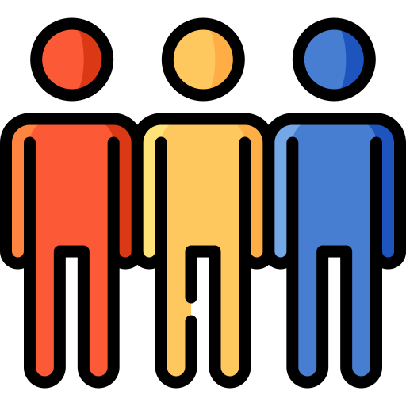

<h1>Hello there! 😃</h1>

<h3><b>About me</b></h3>

I'm Francesco, a  programmer and  a classicist based in <b>Berlin</b>, Germany .
  
Besides using  Go to create and connect APIs for <b>my work as a Back-end Developer</b>, I have some experience in using  Python to explore Machine Learning, by combining  <b>data science</b> with  linguistics,  history and  socio-anthropology.  I enjoy breaking the boundaries between disciplines and I am convinced that the key for our future lies in <b>the combination of hard sciences and humanities</b>. I like to learn something new every day.

<!--
Icons from https://www.flaticon.com
-->

I believe that:

- Good understanding requires time, care, and collaboration 
- Every problem can be solved, provided that we tailor our tools on it and not <i>vice versa</i>
- People form the most valuable Neural Networks of all
- There is nothing so complex that it cannot be explained with a good story

<h3><b>Toolkit</b></h3>

The core components of my daily toolkit are:

<!--
Icons from https://simpleicons.org/
-->

 
  
Specifically for data science, I also use:

 

<h3><b>Where to find me</b></h3>

 

 

